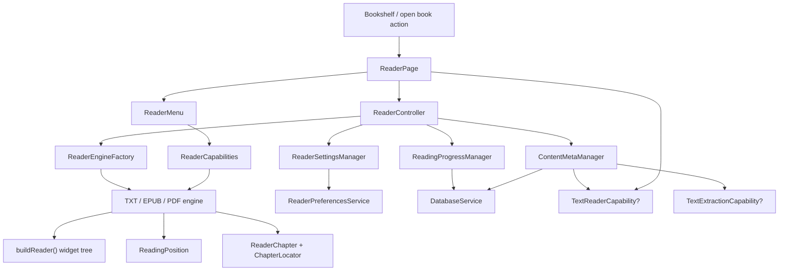

# Reader Architecture Map

This document describes the current reader architecture after the refactor phases that introduced capability-based engines, unified position models, typed chapter navigation, and optional engine capabilities.

## 1. Reader Architecture Overview

The reader is organized as a small layered system:

1. UI layer
   - `ReaderPage` creates the reader session and binds gestures, the One Paper chrome (floating dock that grows in-place into Chapters/Settings sheets), overlays, and menu UI.
   - `ReaderMenu` gates visible controls using `ReaderCapabilities`.
   - `ChapterListWidget` renders the table of contents from typed `ReaderChapter` data.

2. Session controller layer
   - `ReaderController` is the orchestration point for one open book.
   - It owns the active `ReaderEngine` and delegates specialized concerns to managers.

3. Manager layer
   - `ReadingProgressManager` owns progress polling, save cadence, and restore.
   - `ContentMetaManager` owns chapters, current chapter sync, bookmarks, highlights, and snippet backfill.
   - `ReaderSettingsManager` owns reader typography/theme settings and persistence.

4. Engine contract layer
   - `ReaderEngine` defines the shared engine lifecycle and navigation contract.
   - Optional capability interfaces expose text-specific, snippet, and page-metrics behavior only where it is real.

5. Engine implementation layer
   - `TxtReaderEngine`
   - `EpubReaderEngine`
   - `PdfReaderEngine`

6. Persistence / infrastructure layer
   - `DatabaseService` stores reading positions, progress, bookmarks, and highlights.
   - `ReaderPreferencesService` stores reader UI preferences.
   - `BookSourceAccess` provides file access and source normalization.

### Data Flow Summary

`Book -> ReaderController -> ReaderEngine.initialize() -> chapters + reader widget -> ReadingProgressManager / ContentMetaManager -> DatabaseService / preferences`

The UI does not talk to storage directly. The reader page talks to the controller, the controller talks to managers and the engine, and managers talk to persistence.

## 2. Component Interaction Diagram

## 3. ReaderEngine Contract

Current core `ReaderEngine` responsibilities live in [`lib/modules/reader/reader_engine/reader_engine.dart`](./lib/modules/reader/reader_engine/reader_engine.dart).

### Core responsibilities

- `initialize()`
  - Load the source book, parse it, and prepare internal engine state.
- `buildReader(BuildContext context)`
  - Return the widget subtree that renders the book content.
- `goToPosition(ReadingPosition position)`
  - Restore or jump to a unified reading position.
  - This is the current restore entry point; there is no separate `restorePosition()` method.
- `getCurrentPosition()`
  - Return the current logical reading location.
- `setConfig(ReaderConfig config)`
  - Apply engine-supported reader appearance settings.
- `getProgress()`
  - Return normalized reading progress from `0.0` to `1.0`.
- `seekToProgress(double progress)`
  - Jump to a normalized progress position.
- `getChapters()`
  - Return typed chapter data as `List<ReaderChapter>`.
- `goToChapter(ChapterLocator locator)`
  - Navigate using a typed chapter locator.
- `nextPage()` / `previousPage()`
  - Perform the engine's forward/backward navigation step.
- `hasBottomBar`
  - Indicates whether the engine renders its own bottom information bar.
- `dispose()`
  - Release controller/listener/file resources.

### Contract boundaries

The core contract is now intentionally narrow:
- text highlighting is not part of the base contract
- snippet extraction is not part of the base contract
- page metrics are not part of the base contract

Those behaviors are exposed only through optional capability interfaces.

## 4. Optional Capability Interfaces

Optional capabilities also live in [`lib/modules/reader/reader_engine/reader_engine.dart`](./lib/modules/reader/reader_engine/reader_engine.dart).

### `TextReaderCapability`

Purpose:
- bind text interaction callbacks
- push render highlights into an engine
- read paragraph text for anchor healing and selection workflows

Methods:
- `configureInteractions(...)`
- `setHighlights(List<Highlight>)`
- `getParagraphText(int paragraphIndex)`

Implemented by:
- TXT only

Why:
- These APIs are meaningful for paragraph-based text rendering, but not for the current EPUB/PDF implementations.

### `TextExtractionCapability`

Purpose:
- extract snippets from the current location
- backfill bookmark text from a stored `ReadingPosition`

Methods:
- `getSnippet()`
- `getTextAtPosition(ReadingPosition position)`

Implemented by:
- TXT only

Why:
- TXT can resolve paragraph-based text reliably.
- EPUB/PDF do not currently provide trustworthy snippet extraction in this architecture.

### `PageMetricsCapability`

Purpose:
- expose page count and current page index only where those values are real and meaningful

Methods:
- `getPageCount()`
- `getCurrentPageIndex()`

Implemented by:
- TXT
- PDF

Not implemented by:
- EPUB

Why:
- TXT has pagination estimation logic.
- PDF has true page numbers.
- EPUB's previous `0 / 0` values were placeholders, so EPUB is intentionally outside this interface.

## 5. Key Models

### `ReadingPosition`

Unified position model used for save/restore and current-location tracking.

Fields:
- `paragraphIndex`
- `pageNumber`
- `cfi`
- `chapterIndex`

Usage:
- TXT uses `paragraphIndex`
- PDF uses `pageNumber`
- EPUB uses `cfi`

`ReadingProgressManager` serializes and restores this model through `DatabaseService`.

### `ChapterLocator`

Typed navigation payload for chapter jumps.

Fields:
- `chapterIndex`
- `pageNumber`
- `contentIndex`

Usage:
- TXT chapter navigation uses `chapterIndex` as the starting paragraph index
- PDF chapter navigation uses `pageNumber`
- EPUB chapter navigation uses `contentIndex`

### `ReaderChapter`

Typed TOC / chapter list item.

Fields:
- `title`
- `locator`
- `index`
- `isSynthetic`

Usage:
- `ReaderEngine.getChapters()` returns `List<ReaderChapter>`
- `ChapterListWidget` renders it directly
- `ContentMetaManager` uses `ReaderChapter.locator` for previous/next chapter navigation

### `ReaderCapabilities`

UI-facing capability matrix. Since P2-4 each capability is a `CapabilityLevel` (`none / limited / full`) rather than a boolean; `supportsXxx` boolean getters remain as convenience wrappers (`level != none`).

Fields:
- `typography: CapabilityLevel`
- `theme: CapabilityLevel`
- `highlights: CapabilityLevel`
- `annotations: CapabilityLevel`
- `pageAnimation: CapabilityLevel`
- `chapterNavigation: ReaderChapterNavigation` (`none / semantic / synthetic`)

Usage:
- `ReaderMenu` hides unsupported controls
- `ReaderPage` hides TOC drawer behavior for engines without chapter navigation
- managers use capabilities to decide whether highlight flows should run

## 6. Engine Responsibilities and Capability Matrix

### TXT engine

File: [`lib/modules/reader/reader_engine/txt/txt_reader.dart`](./lib/modules/reader/reader_engine/txt/txt_reader.dart)

Role:
- decode TXT bytes
- split content into paragraphs
- detect chapters from text patterns
- render paragraph list with highlights
- estimate pagination and expose page metrics

Core characteristics:
- paragraph-based reading model
- chapter detection is regex-based
- highlight rendering and anchor healing are supported
- pagination is layout-sensitive and cached by layout key

Implements optional capabilities:
- `TextReaderCapability`
- `TextExtractionCapability`
- `PageMetricsCapability`

### EPUB engine

File: [`lib/modules/reader/reader_engine/epub/epub_reader.dart`](./lib/modules/reader/reader_engine/epub/epub_reader.dart)

Role:
- open EPUB bytes through `epub_view`
- map parsed sections into typed `ReaderChapter`
- restore and persist location using EPUB CFI

Core characteristics:
- progress is paragraph/content based rather than page based
- chapter navigation uses `contentIndex`
- typography/theme config is currently not engine-driven
- page metrics are intentionally not exposed

Implements optional capabilities:
- none currently

### PDF engine

File: [`lib/modules/reader/reader_engine/pdf/pdf_reader.dart`](./lib/modules/reader/reader_engine/pdf/pdf_reader.dart)

Role:
- open PDF through `pdfx`
- restore and persist location by page number
- expose synthetic chapter entries every N pages for minimal navigation

Core characteristics:
- true page-number navigation
- no text highlights or snippets in the current architecture
- synthetic TOC only, so `chapterNavigation` is `synthetic`

Implements optional capabilities:
- `PageMetricsCapability`

### Capability matrix

| Engine | Typography | Theme | Highlights | Annotations | Page Animation | Chapter Navigation | TextReaderCapability | TextExtractionCapability | PageMetricsCapability |
| --- | --- | --- | --- | --- | --- | --- | --- | --- | --- |
| TXT | full | full | full | full | none | semantic | Yes | Yes | Yes |
| EPUB | none | none | none | none | none | semantic | No | No | No |
| PDF | none | none | none | none | none | synthetic | No | No | Yes |

## 7. Navigation and Restore Flows

### Book open flow

1. A `Book` is passed into `ReaderPage`.
2. `ReaderPage` creates `ReaderController(book)`.
3. `ReaderController` creates the active engine via `ReaderEngineFactory.create(book)`.
4. Controller constructs:
   - `ReaderSettingsManager`
   - `ContentMetaManager`
   - `ReadingProgressManager`
5. `ReaderController._loadBook()` executes:
   - `engine.initialize()`
   - `metaManager.loadChapters()`
   - `progressManager.restoreLastPosition()`
   - `metaManager.syncCurrentChapterFromPosition(...)`
   - `metaManager.loadHighlights()`
6. `ReaderPage` displays `engine.buildReader(context)`.

### Progress restore flow

1. `ReadingProgressManager.restoreLastPosition()` queries `DatabaseService.getBookPosition(book.id)`.
2. Stored payload is decoded into `ReadingPosition.fromJson(type, payload)`.
3. The manager calls `engine.goToPosition(position)`.
4. After restore, the manager refreshes current engine position/progress.
5. For EPUB, there is still a safety fallback to saved normalized progress if CFI restore does not visibly move the engine.

### Progress save flow

1. `ReadingProgressManager` polls the engine periodically and on save events.
2. `engine.getCurrentPosition()` returns a unified `ReadingPosition`.
3. `engine.getProgress()` returns normalized progress.
4. The manager writes both to `DatabaseService.updateBookPosition(...)`.

### Chapter navigation flow

1. `ContentMetaManager.loadChapters()` gets `List<ReaderChapter>` from the engine.
2. `ChapterListWidget` renders those `ReaderChapter` items.
3. UI taps call `ReaderController.jumpToChapter(index, chapter.locator)`.
4. Controller delegates to `ContentMetaManager.jumpToChapter(...)`.
5. The manager calls `engine.goToChapter(locator)`.
6. The manager then resyncs current chapter index and saves progress.

### Highlight / bookmark text flow

1. TXT selection events are bound through `TextReaderCapability.configureInteractions(...)`.
2. `ContentMetaManager` uses `TextReaderCapability.getParagraphText(...)` for anchor healing.
3. Bookmark creation uses `TextExtractionCapability.getSnippet()`.
4. Bookmark snippet backfill uses `TextExtractionCapability.getTextAtPosition(...)`.

## 8. Main Files

- [`lib/modules/reader/reader_page.dart`](./lib/modules/reader/reader_page.dart)
- [`lib/modules/reader/controllers/reading_progress_manager.dart`](./lib/modules/reader/controllers/reading_progress_manager.dart)
- [`lib/modules/reader/controllers/content_meta_manager.dart`](./lib/modules/reader/controllers/content_meta_manager.dart)
- [`lib/modules/reader/controllers/reader_settings_manager.dart`](./lib/modules/reader/controllers/reader_settings_manager.dart)
- [`lib/modules/reader/reader_engine/reader_engine.dart`](./lib/modules/reader/reader_engine/reader_engine.dart)
- [`lib/modules/reader/reader_engine/txt/txt_reader.dart`](./lib/modules/reader/reader_engine/txt/txt_reader.dart)
- [`lib/modules/reader/reader_engine/epub/epub_reader.dart`](./lib/modules/reader/reader_engine/epub/epub_reader.dart)
- [`lib/modules/reader/reader_engine/pdf/pdf_reader.dart`](./lib/modules/reader/reader_engine/pdf/pdf_reader.dart)
- [`lib/modules/reader/widgets/chapter_list_widget.dart`](./lib/modules/reader/widgets/chapter_list_widget.dart)
- [`lib/modules/reader/widgets/reader_menu.dart`](./lib/modules/reader/widgets/reader_menu.dart)

## 9. Remaining Technical Debt

The reader architecture is much cleaner than before, but a few cleanup items remain:

1. Compatibility wrappers for old engine-specific positions still exist.
   - `TxtReadingPosition`
   - `EpubReadingPosition`
   - `PdfReadingPosition`
   These are now mostly thin wrappers around `ReadingPosition`.

2. `ReaderEngine.goToChapter(...)` still has a default no-op implementation.
   - It is harmless, but still a placeholder in the core contract.

3. `ReaderEngine.setConfig(...)` remains a no-op in EPUB and PDF.
   - UI capability gating hides unsupported controls, but the core contract still carries this method.

4. ~~`ReaderCapabilities` is still mostly boolean-only.~~ Resolved by P2-4: every capability is now a `CapabilityLevel` (`none / limited / full`). No engine currently declares `limited`, so the intermediate level is exercised only by the type system.

5. PDF chapter data is synthetic.
   - `ReaderChapter` supports `isSynthetic`, but there is no richer typed distinction yet.

6. TXT page metrics are estimated, not exact layout pages.
   - They are still useful, but should not be interpreted as a universal page abstraction.

## 10. Future Extension Points

The current architecture is well positioned for incremental extension:

1. Add a new engine
   - implement `ReaderEngine`
   - add only the optional capabilities that are real
   - declare `ReaderCapabilities`

2. Add EPUB text annotations later
   - implement `TextReaderCapability` and/or `TextExtractionCapability` only when EPUB text lookup is reliable

3. Use the `limited` capability level
   - the `none / limited / full` levels exist (P2-4); when an engine gains partial support (e.g. EPUB theme-only config), declare `limited` instead of adding new booleans

4. Add typed synthetic navigation models
   - if PDF TOC evolves, split semantic chapters from synthetic navigation more explicitly

5. Add analytics / sync hooks
   - `ReadingProgressManager` is the natural seam for cloud sync and session analytics

6. Add text-to-speech
   - text-capable engines can expose another optional capability instead of expanding the core contract

7. Add advanced page metrics
   - if future engines support reliable page semantics, extend `PageMetricsCapability` instead of widening `ReaderEngine`
